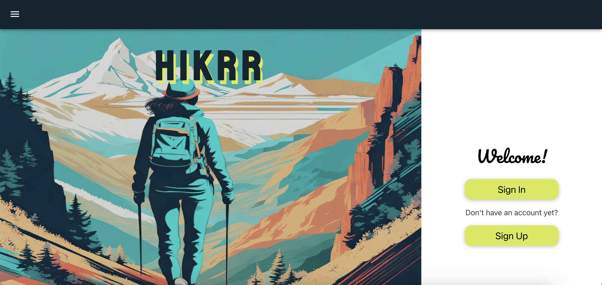
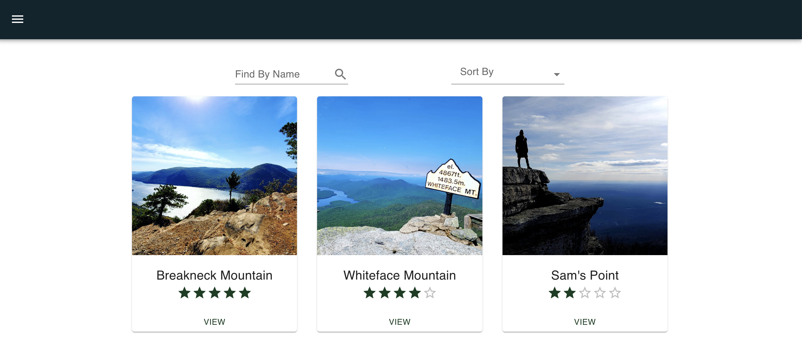

## Hikerr 

##  Date: 5/04/2022 *Updated 2/18/2024

## By: Magdalena Joseph

***

### ***Description***
#### "Hikrr" is a hiking web application. You can browse different trails, browse photos, maps and leave comments. I'm using Google Maps API to help the user find the trail head location. There's a User Authentication and the app has full CRUD functionality. You can register and after logging in you can make add hikes, photos, update them or delete them. There is a page with a timer. You can record your hiking time and save in in the app. Are you ready for your next outdoor adventure? 
***
### ***Technologies***
#### This has been accomplished by:
### PostgreSQL, Node.js, React, Express.js, CSS

***
##### A Trello board was used to keep track of development progress and can be viewed here: [Trello](https://trello.com/b/tnHWIZYP/hikrr).
##### Entity Relationship Diagrams can be viewed here: [ERD](https://drive.google.com/file/d/1iXcn6ZwUDru3AWCR76V37RX9ufdVR4Rk/view?usp=sharing).
##### Comopnent Hierarchy Diagram can be viewd here: [Diagram](https://lucid.app/lucidchart/fc358db7-8ee0-436e-bbf1-737cfcb73f73/edit?invitationId=inv_76c7290b-1c21-4195-b44b-ef389cffdf39).
***
### ***Future Updates***
##### [ ] - Display directions in Maps
##### [ ] - Add interactive maps
***
### ***Getting Started***
##### Fork and clone this repository to your terminal window
****

### ***Credits***
##### Articles: Alltrails.com
